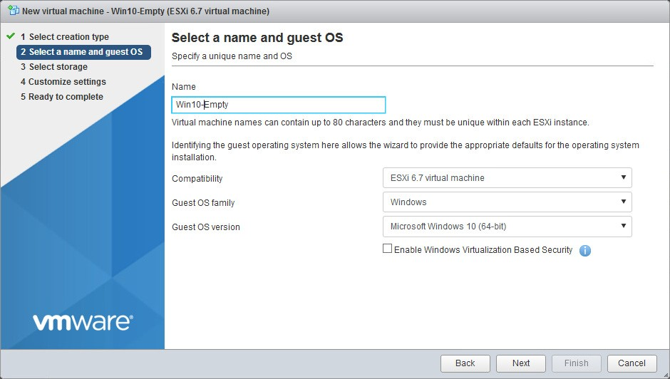
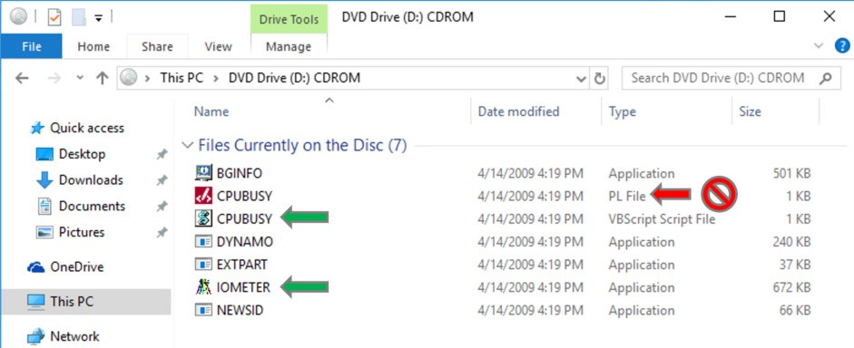

# *Lab 1* Deploying and Configuring Virtual Machines 

**Objective: Create and prepare a virtual machine for use**

> In this lab, you perform the following tasks:

* Access Your Student Desktop

* Create a Virtual Machine

* Install VMware Tools

* Copy Files to the Desktop

> In this lab, you use vSphere Client to perform the tasks.

---

## Task 1: Create a Virtual Machine

> You create a virtual machine based on specific requirements, such as a particular operating system or hardware configuration. You create a virtual machine that you use in this task only. In subsequent tasks, prebuilt virtual machines are in place.

1. [] From your student desktop Student-a-01, connect to your VMware Host Client instance.
2. [] Click the Google Chrome icon from the taskbar of your student desktop.
3. [] From the bookmarks toolbar, select **Host Client (SA-ESXi-01)**.
4. [] Log in with the host user name +++root+++ and the password +++VMware1!+++.
> VMware Host Client opens with **Host** selected in the Navigator pane.

5. [] In the right pane, click **Create/Register VM** to open the New virtual machine wizard.
6. [] On the Select creation type page, verify that **create a new virtual machine** is selected and click **Next**.
7. [] On the Select a name and guest OS page, configure settings for your virtual machine.
    1. Name your virtual machine +++Win10-Empty+++.
    2. From the **Compatibility** drop-down menu, select **ESXi 6.7 virtual machine**.
    3. From the **Guest OS family** drop-down menu, select **Windows**.
    4. From the **Guest OS version** drop-down menu, select **Microsoft Windows 10 (64-bit)** and click **Next**.

   
8. [] On the Select storage page, select the **Class-Datastore** datastore and click **Next**.
9. [] On the Customize settings page, configure settings.
    1. From the **CPU** drop-down menu, select **1**.
    1. Enter **1024 MB** in the **Memory** text box and enter **12 GB** in the **Hard Disk 1** text box.
    1. Find CD/DVD Drive 1 and select **Datastore ISO file** from the drop-down menu.
    1. In the Datastore browser window, select Class-Datastore for the sa-esxi-01.vclass.local ESXi host.
    1. From the Class-Datastore, navigate to the Windows 10 operating system ISO image:
> en\_windows\_10\_enterprise\_version\_1607\_9714415.iso

10. [] Click **Select**.
11. [] Click the arrow next to CD/DVD Drive 1.
12. [] Verify that the **Connect at power on** check box is selected and click **Next**.
13. [] On the Ready to Complete page, review the information and click **Finish**.
14. [] In the Navigator pane, verify that the virtual machine number count is 4.
15. [] In the Navigator pane, select **Virtual Machines** and verify that your newly created virtual machine appears in the right pane.
16. [] Click on the **Win10-Empty** virtual machine name in the right pane.
> **NOTE**
>
> Be sure to click the name of the VM, not just the row. The center pane will update to display information about the selected virtual machine.

17. [] Examine the General Information pane, the Hardware Configuration pane, and the Resource Consumption pane to review the current settings.
18. [] In the Hardware Configuration pane, expand **Hard disk 1** and record information.

    -   Backing \_\_\_\_\_\_\_\_\_\_

    -   Capacity \_\_\_\_\_\_\_\_\_\_

    -   Thin provisioned \_\_\_\_\_\_\_\_\_\_

> **NOTE**
>
> In a production environment, the next step is to install an operating system to the new virtual machine. In order to conserve class and lab time, task 3 uses a prebuilt virtual machine with a guest operations system already installed.
===

## Task 2: Install VMware Tools

> The virtual machine used to continue the lab has the operating system installed and optimized. To continue, you install VMware Tools™ in the Win10-01 virtual machine using your keyboard.

1. [] In VMware Host Client for sa-esxi-01.vclass.local Navigator pane, click **Virtual Machines**.
2. [] In the center pane, right-click your **Win10-01** virtual machine and select **Power &gt; Power on**.
3. [] Once the VM has completely powered on, right-click your **Win10-01** virtual machine and select **Console &gt; Open console in a new tab**.
> You are logged in to the Win10-01 virtual machine as vclass\\administrator with the password VMware1!.

4. [] In VMware Host Client for sa-esxi-01.vclass.local, right-click your **Win10-01** virtual machine and select **Guest OS &gt; Install VMware Tools**.
5. [] Return to and right-click the **Win10-01 Console** tab and select **Reload Tab** from the drop-down menu.
6. [] Press the Tab key on your keyboard to navigate to and select the **Windows Start** icon in the lower left corner of the Win10-01 desktop.
7. [] Once the Windows Start icon is selected, press Enter.
> The Windows Start menu opens.

8. [] Press Tab twice to select the second column of the Windows Start menu.
9. [] Press the downward arrow key until **Windows System** is selected, then press Enter.
10. [] Press the downward arrow key until **This PC** is selected, then press Enter.
> The This PC window opens.

11. [] Press the right arrow once, then press the downward arrow until **DVD Drive (D:)** is selected.
12. [] Press Enter.
> VMware Tool Setup opens.

13. [] Install VMware Tools.

    1. On the Welcome to the installation wizard for VMware Tools page, press Enter to select **Next**.
    1. On the Choose Setup Type page, validate that **Typical** is selected.
    1. Press Tab twice to select **Next** and then press Enter.
    1. On the Ready to Install VMware Tools page, press Enter to select **Install**.
    1. When the installation is complete, press Enter to select **Finish**.
    1. When the Windows request to restart message appears, press Enter to select Yes to proceed.

> After the login page appears in the virtual machine console, you are logged in as vclass\\administrator with the password VMware1!.
>
> Leave the virtual machine console open for the next task.

===

## Task 3: Copy Files to the Desktop

> You mount an ISO image to the virtual machine's CD/DVD drive so that the files can be copied to the virtual machine desktop for use in later labs.

1. [] In VMware Host Client for sa-esxi-01.vclass.local, right-click virtual machine **Win10-01** and select **Edit Settings**.
2. [] Expand **CD/DVD Drive 1** by clicking the arrow next to it.
3. [] Select **Datastore ISO** from the **CD/DVD Drive 1** drop-down menu.
4. [] In the Datastore browser window, browse to the **Class-Datastore** for the sa-esxi-01.vclass.local ESXi host.
5. [] From the Class-Datastore, select **ClassFiles-vSphere.iso** and click **Select**.
6. [] Verify that the **Connect at power on** check box is selected for CD/DVD Drive 1 and click **Save**.
7. [] Return to the **Win10-01-Console** tab.
8. [] Click the Windows **Start** icon and navigate to **Windows System &gt; This PC**.
9. [] Double-click the **DVD drive (D:)** shortcut to open the **ClassFiles-vSphere.iso** image. **Lab 1** Deploying and Configuring Virtual Machines
10. [] Copy the CPUBUSY VBScript Script File (not the CPUBUSY PL File) and the IOMETER application file from the DVD drive (D:) to the virtual machine desktop for use in later labs.

    

11. [] Press the Ctrl key to select and drag the **CPUBUSY** VB Script File and **IOMETER** Application files to the Win10-01 desktop.
12. [] Close the DVD Drive (D:) CDROM screen.
13. [] Close the **Win10-01 - Console** tab.
14. [] Return to VMware Host Client and disconnect the virtual machine from ClassfilesvSphere.iso on the CD/DVD drive.

    1. In VMware Host Client, right-click the **Win10-01** virtual machine and select **Edit Settings**.
    1. In Virtual Hardware, locate **CD/DVD Drive 1**.
    1. From the drop-down menu, select **Host device**.
    1. Deselect the **Connect** check box next to CD/DVD Drive 1.
    1. Click **Save**.

15. [] Log out of VMware Host Client (SA-ESXi-01) and close the Google Chrome web browser.
16. [] Inform your instructor that you have completed this lab. If prompted, continue to the next lab.

---

# Congratulations!

You have successfully completed this Module, to mark the lab as complete click on the menu in the upper right-hand corner and select **End**.
