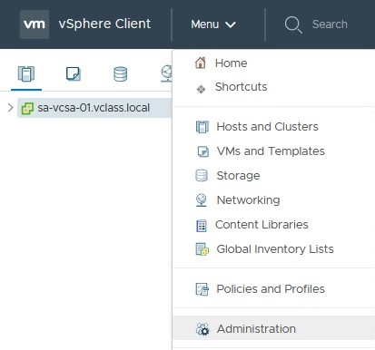
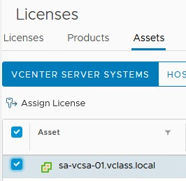
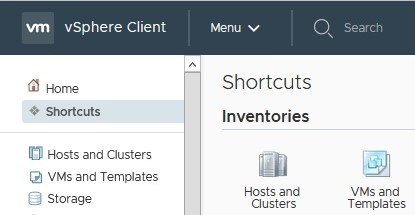
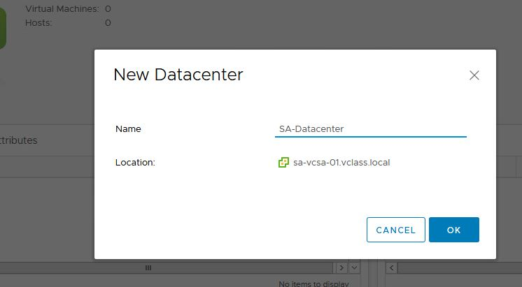
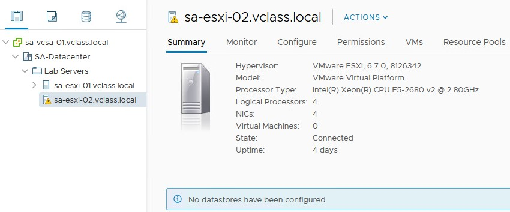
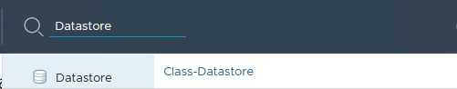

# Lab 2 Working with vCenter Server Appliance

**Objective: Configure and use vCenter Server Appliance**

> In this lab, you perform the following tasks:

* Access your vCenter Server Appliance and Configure Licenses

* Configure Single Sign-On and Create a Data Center Object

* Add Your ESXi Hosts to the vCenter Server Inventory

* Configure the ESXi Hosts as NTP Clients

* Create a Host and Cluster Folder

* Create Virtual Machine and Template Folders

* Navigate vSphere Client

---

## Task 1: Access your vCenter Server Appliance and Configure Licenses

> You connect to the vSphere Client and license both vCenter Server and ESXi hosts.

1. [] In the Google Chrome web browser, click **vSphere Site-A** on the bookmarks toolbar and select **vSphere Client (SA-VCSA-01)**.
2. [] Log in to vCenter Server with the user name +++administrator@vsphere.local+++ and the password +++VMware1!+++.
3. [] In vSphere Client, click the **Menu** icon and select **Administration**.

    

4. [] In the Navigator pane, select **Licenses**.
5. [] In the Licenses pane, verify that the **Licenses** tab is selected.
6. [] Click the **Add New Licenses** icon (the plus sign).
7. [] On the Enter license keys page, enter the  VMware vCenter Server 6 Standard key +++14437-QCJ15-L8P9A-0ACKM-2W92J+++ license key in the **License keys** text box.  Press enter and add the vSphere 6 Enterprise Plus key +++J06A5-ZYL45-78Z84-0P1A2-A4VKJ+++

> You must enter the license keys on separate lines.

8. [] Verify that both licenses are listed correctly in the text box and click **Next**.
9. [] On the Edit license names page, enter +++VMware vCenter Server+++ and +++VMware ESXi+++ in the appropriate **License name** text boxes.
10. [] Click **Next**.
11. [] On the Ready to complete page, click **Finish**.
12. [] In the Licenses pane, click the **Assets** tab.
13. [] Select the **sa-vcsa-01.vclass.local** check box and click **Assign License**.

    

14. [] In Assign License, select the updated vCenter Server license and click **OK**.
> At the bottom of the Assign License page, the Some features will become unavailable message appears.

15. [] Close the **There are vCenter Server systems with expired or expiring licenses in your inventory** warning window.

===

## Task 2: Create a Data Center Object

> You create a data center object.

1. [] Click the **Menu** icon and select **Shortcuts**.
2. [] In the Inventories pane, click **Hosts and Clusters**.

    

3. [] In the Navigator pane, right-click **sa-vcsa-01.vclass.local** and select **New Datacenter**.
4. [] In the New Datacenter **Name** text box, enter +++SA-Datacenter+++ and click **OK**.

> In the Navigator pane, you should see that the new data center object is listed under vCenter Server Appliance.

===

## Task 3: Add Your ESXi Hosts to the vCenter Server Inventory

> You add ESXi hosts to the vCenter Server inventory.

1. [] In the Navigator pane, right-click **SA-Datacenter** and select **Add Host**.
> The Add Host wizard appears.

2. [] On the Name and location page, enter +++sa-esxi-01.vclass.local+++ and click **Next**.
3. [] On the Connection settings page, enter +++root+++ as the user name, enter the password +++VMware1!+++, and click **Next**.
4. [] If you see a security alert stating that the certificate store of vCenter Server cannot verify the certificate, click **Yes** to proceed.
5. [] On the Host summary page, review the information and click **Next**.
6. [] On the Assign license page, click the VMware ESXi license key and click **Next**.
7. [] On the Lockdown mode page, accept the default Disabled and click **Next**.
8. [] On the VM location page, accept the default and click **Next**.
9. [] On the Ready to complete page, review the information and click **Finish**.
10. [] In the Recent Tasks pane, monitor the progress of the task.
11. [] Repeat steps 1 through 10 to add **sa-esxi-02.vclass.local** to the Navigator pane
12. [] In the Navigator pane, expand **SA-Datacenter**.
13. [] In the Navigator pane, select **sa-esxi-01.vclass.local**.
> The **Summary** tab opens in the right pane. This tab displays information for the ESXi host, such as CPU, memory, storage, NICs, and virtual machines.

14. [] Click the arrow next to the Hardware pane to view the hardware details of the ESXi host.

    

===

## Task 4: Configure the ESXi Hosts as NTP Clients

> You configure the ESXi hosts to use Network Time Protocol (NTP) to maintain accurate time and date.

1. [] In the right pane, click the **Configure** tab.
> When repeating steps for your second host, select **sa-esxi-02.vclass.local** from the Navigation pane.

2. [] Navigate to **System** in the middle pane and select **Time Configuration** to view the current settings.
3. [] Click **Edit**.
4. [] Click **Use Network Time Protocol (Enable NTP client)**.
5. [] In the **NTP Servers** text box, enter +++172.20.10.10+++.
6. [] Next to NTP Service Status, select the **Start NTP Service** check box.
7. [] From the **NTP Service Startup Policy** drop-down menu, select **Start and stop with host**.
8. [] Click **OK**.
9. [] In the Time Configuration pane, verify that the NTP client appears as Enabled and that the NTP service status appears as Running.
10. [] Repeat steps 1 though 9 to configure your second ESXi host.
> In the current lab configuration, no datastores have been configured. Datastores are added in a later lab.

    

===

## Task 5: Create a Host and Cluster Folder

> You create a folder to group hosts and clusters of the same type.

1. [] In the upper left-hand corner of vSphere Client, click **vSphere Client**.
> The vSphere Client Shortcuts page opens.

2. [] Click **Hosts and Clusters**.
3. [] In the Navigator pane, right-click **SA-Datacenter** and select **New Folder** &gt; **New Host and Cluster Folder**.
4. [] In the **Enter a name for the folder** text box, enter +++Lab Servers+++ and click **OK**.
5. [] Drag both the ESXi hosts to the Lab Servers folder.
6. [] In the Recent Tasks pane, monitor the Move Entities tasks until they are completed.

===

## Task 6: Create Virtual Machine and Template Folders

> You use folders to group virtual machines of the same type.

1. [] In vSphere Client, click the **Menu** icon and select **VMs and Templates**.
2. [] Right-click **SA-Datacenter** and select **New Folder** &gt; **New VM and Template Folder**.
3. [] In the **Enter a name for the folder** text box, enter +++Lab VMs+++ and click **OK**.
4. [] In the Navigator pane, expand the **SA-Datacenter** object.
5. [] Right-click the **Win10-Empty** virtual machine.
6. [] In the Actions - Win10-Empty menu, click **Delete from Disk**.
7. [] In the Confirm Delete section, click **Yes**.
8. [] In the Navigator pane, drag the Win10-01 and Win10-02 virtual machines to the Lab VMs folder.
9. [] Expand the Lab VMs folder to verify that both virtual machines are in the folder.
10. [] Right-click **SA-Datacenter** and select **New Folder** &gt; **New VM and Template Folder** to create a second virtual machine folder.
11. [] In the **Enter a name for the folder** text box, enter +++Templates+++ and click **OK**.
> The Templates folder that you created in this lab appears in the Navigator pane.

12. [] Right-click the Labs VMs folder and review the menu commands in the drop-down menu.
13. [] Click the **Host and Clusters** icon.
14. [] Right-click the Lab Servers folder and review the menu commands in the drop-down menu.

> **Q1. What is the difference between the menu commands in the drop-down menus of the Lab VMs folder and the Lab Servers folder?**
>
> 1. The Lab Servers folder has menu commands related to host actions whereas the Lab VMs folder has menu commands related to virtual machines.

===

## Task 7: Navigate vSphere Client

> In VMware vSphere® Client, you navigate through the objects in the navigation tree and view the configuration settings to become familiar with the UI layout.

1. [] In the Navigator pane, click the arrow next to each object to expand the view completely.
2. [] In the Navigator pane, select **sa-esxi-01.vclass.local**.
3. [] In the right pane, review the **Summary** tab and record the following information.

    -   Hypervisor \_\_\_\_\_\_\_\_\_\_

    -   Logical Processors \_\_\_\_\_\_\_\_\_\_

    -   NICs \_\_\_\_\_\_\_\_\_\_

4. [] On the **Summary** tab, expand the **Hardware** and **Configuration** panes to review the information.
5. [] In the Navigator pane, select **sa-vcsa-01.vclass.local** to return to the top of the navigation tree.
6. [] In the **Search** text box on the top, enter **datastore**.
7. [] When the datastore names appear under the search box, click **Class-Datastore**.

    

8. [] On the **Summary** tab, review the datastore details in the Details pane.
9. [] In vSphere Client, Click the **Menu** icon and select **Home**.
10. [] Log out of vSphere Client and close the Google Chrome web browser.
11. [] In the next lab, you use vSphere Web Client to perform the tasks.
12. [] Inform your instructor that you have completed this lab. If prompted, continue to the next lab.

---

# Congratulations!

You have successfully completed this Module, to mark the lab as complete click on the menu in the upper right-hand corner and select **End**.
